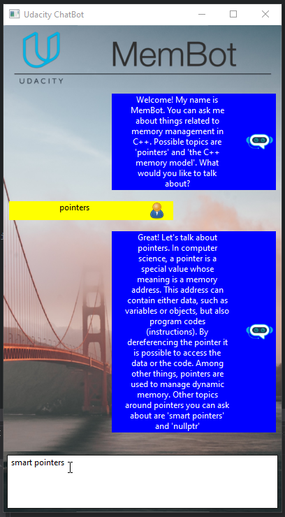

# ND-Cpp-ChatBot
### *A ChatBot application which uses wxWidgets and C++*

***

<ins>**Description:**</ins>

A Memory-Management Chatbot application which uses **C++17** and **wxWidgets** to display information in a graphical application using user input as keywords.
This project is my submission for the [Udacity Project](https://github.com/udacity/CppND-Memory-Management-Chatbot) which requires writing C++ code for efficient usage of stack and heap memory, implementatation of memory management techniques usch as Rule of Five, usage of smart pointers, etc. to optimize the performance of the Chatbot application.  

This project uses the [wxWidgets](https://www.wxwidgets.org/) library, which is a cross-platfrom GUI library.

This project is specifically designed to generate Visual Studio solution files easily and run on the Windows Operating System. The original Udacity project requires setting up the wxWidgets library. 
This project already has the libraries and the cmake file is edited to find the required files.

***

<ins>**Cloning:**</ins>

Clone this project to a local destination using git :  
`git clone https://github.com/CybernetHacker14/ND-Cpp-ChatBot`  

***

<ins>**Pre-requisites:**</ins>

In order to generate the solution files, the following softwares need to be installed.

1. Visual Studio.
2. CMake.
3. PowerShell 7.0.3 or newer.

***

<ins>**Installation:**</ins>

1. Create a folder named '_solutiondir' in the outermost level of the repo, where the src and CMakeLists.txt files exists.
2. Open a Powershell window inside the `_solutiondir` folder and execute the command `cmake ..` which will generate Visual Studio project and solution files.
3. On running the application inside Visual Studio, the application will crash, hence to make it work, copy the `.dll` files inside the `bin` folder to the output directory - where the `.exe` file exists.

These steps will generate a Visual Studio solution file. Set the 'membot' as the startup 
project, and run it.

***

<ins>**Screenshot:**</ins>

